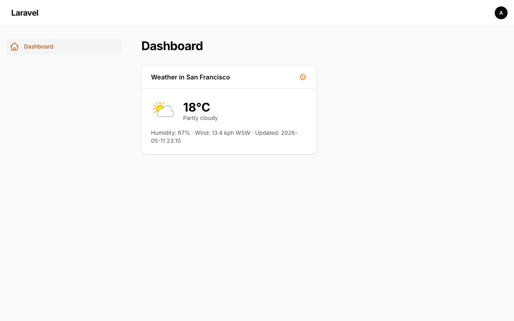
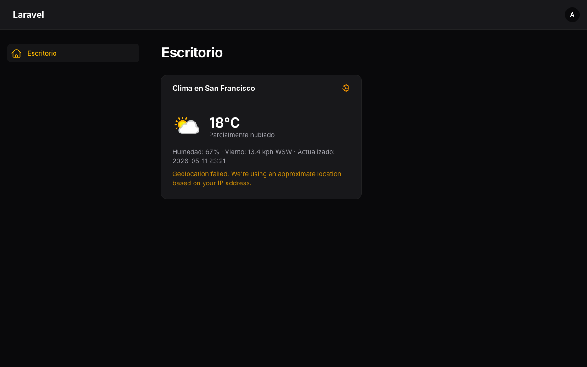
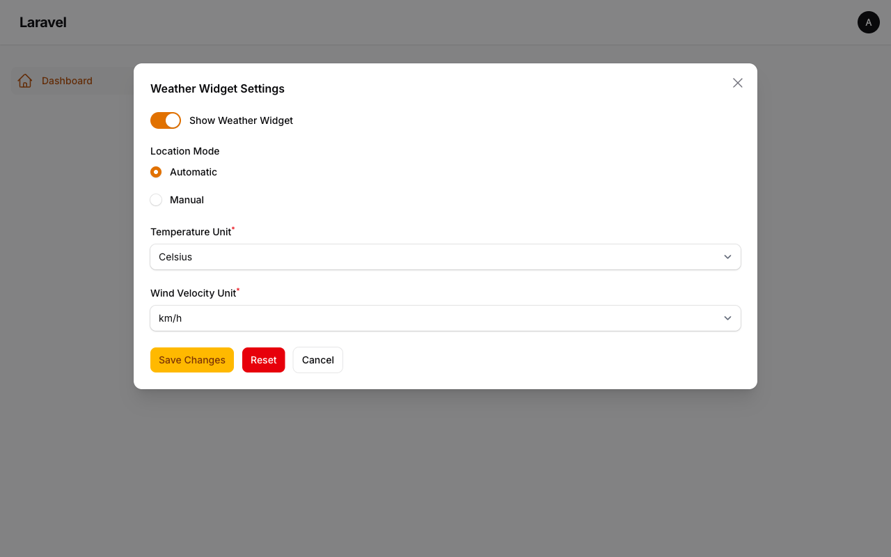
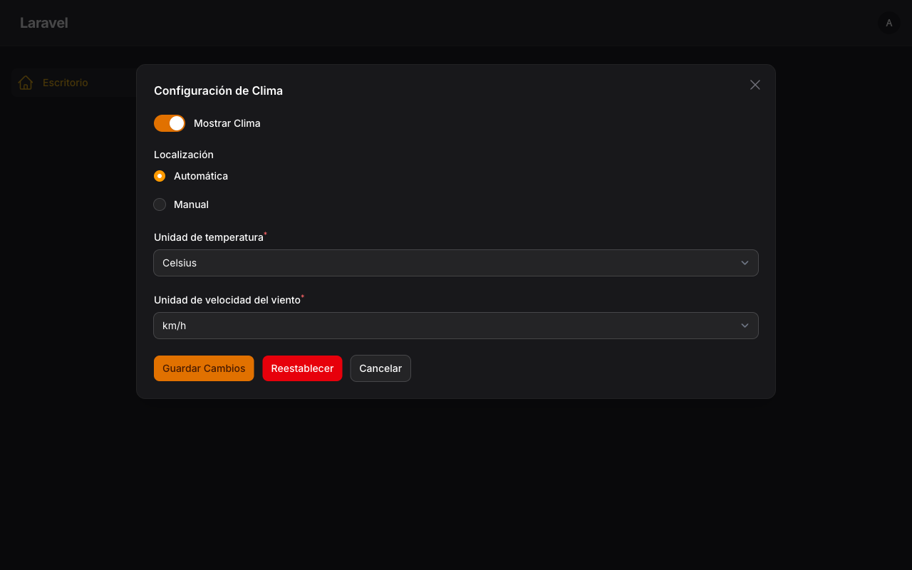

# Filament Weather Widget

A configurable weather widget for Filament admin panels. Displays current
conditions on the dashboard with a settings modal users can open to switch
location mode, temperature unit, and wind unit.

## Screenshots

| Light · English | Dark · Spanish |
|---|---|
|  |  |
|  |  |

## Features

- Current weather rendered on any Filament dashboard
- Per-user settings persisted between visits
- Automatic location (browser geolocation, IP fallback) or manual
- Celsius / Fahrenheit and km/h / mph toggles
- Cached payloads (30 min default) keyed per user + locale
- Multi-language UI (English, Spanish ships in the box)
- Light and dark theme

## Compatibility

| Version line | PHP | Laravel | Filament |
|---|---|---|---|
| `^2.0` (current) | 8.2+ (8.3+ on Laravel 13) | 11, 12, 13 | 4, 5 |
| `^1.0` (maintenance) | 8.2+ | 11, 12 | 3.3 |

A [WeatherAPI](https://www.weatherapi.com) API key is required.

## Installation

```bash
composer require transistorizedcmd/filament-weather-widget
```

For Filament 3 projects, pin the 1.x line:

```bash
composer require "transistorizedcmd/filament-weather-widget:^1.0"
```

The service provider is auto-registered through Laravel's package
discovery — no manual `config/app.php` edit needed.

Set your WeatherAPI key in `.env`:

```dotenv
WEATHER_API_KEY=your_api_key_here
```

Register the widget on your Filament panel
(`app/Providers/Filament/AdminPanelProvider.php`):

```php
use Transistorizedcmd\FilamentWeatherWidget\Widgets\WeatherWidget;

public function panel(Panel $panel): Panel
{
    return $panel
        // ...
        ->widgets([
            WeatherWidget::class,
        ]);
}
```

## Configuration

Publish the config (optional — only if you want to change defaults):

```bash
php artisan vendor:publish --tag="filament-weather-widget-config"
```

`config/filament-weather-widget.php`:

| Key | Default | Notes |
|---|---|---|
| `enabled` | `true` | Toggles `canView()` for the widget. |
| `default_location` | `'London'` | Used when a user has not set a manual location. |
| `default_unit` | `'celsius'` | `celsius` or `fahrenheit`. |
| `default_wind_unit` | `'kph'` | `kph` or `mph`. |
| `service` | `'weatherapi'` | Registered service key (see [Custom providers](#custom-providers)). |
| `weatherapi.key` | `env('WEATHER_API_KEY')` | API key. |
| `weatherapi.base_url` | `https://api.weatherapi.com/v1` | Useful for staging or proxies. |

All keys can also be set via env (`WEATHER_WIDGET_ENABLED`,
`WEATHER_WIDGET_LOCATION`, `WEATHER_DEFAULT_UNIT`, `WEATHER_DEFAULT_WIND_UNIT`,
`WEATHER_WIDGET_SERVICE`, `WEATHER_API_KEY`, `WEATHER_API_BASE_URL`).

## Localization

Spanish (`es`, `es_MX`) and English (`en`) ship with the package. To override
or add a locale, publish the translations and edit the resulting files:

```bash
php artisan vendor:publish --tag="filament-weather-widget-translations"
```

## Customization

Publish the Blade view to tweak markup:

```bash
php artisan vendor:publish --tag="filament-weather-widget-views"
```

Publish the front-end assets if you need to customize the geolocation
fallback behavior:

```bash
php artisan vendor:publish --tag="filament-weather-widget-scripts"
```

## Custom providers

The package ships with a [WeatherAPI](https://www.weatherapi.com) implementation
out of the box, behind a `WeatherServiceInterface`:

```php
interface WeatherServiceInterface
{
    public function getCurrentWeather(string $location, array $settings): array;
}
```

To register an alternate provider (OpenWeatherMap, Tomorrow.io, an internal
service, etc.), implement the interface and bind it on the manager in your
own service provider:

```php
use Transistorizedcmd\FilamentWeatherWidget\Services\WeatherServiceManager;

public function boot(): void
{
    $this->app->extend(WeatherServiceManager::class, function (WeatherServiceManager $manager) {
        $manager->addService('my-service', new MyWeatherService(/* … */));
        return $manager;
    });
}
```

Then point the widget at it via env or config:

```dotenv
WEATHER_WIDGET_SERVICE=my-service
```

## Testing

```bash
composer test
```

The suite runs against Orchestra Testbench and uses a mocked Guzzle handler
for the WeatherAPI client, so no real API key is needed during tests. CI
exercises a matrix of PHP 8.2/8.3/8.4 × Laravel 11/12/13 × Filament 4/5
(excluding Laravel 13 + PHP 8.2, which is unsupported upstream).

## Contributing

Pull requests welcome. Please open an issue first for substantive changes.

## License

MIT.
