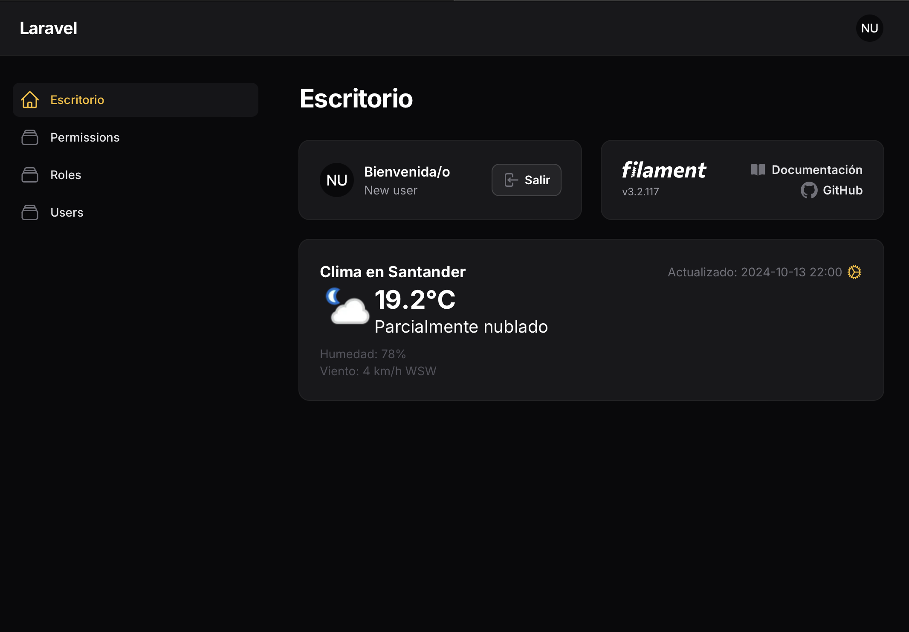

# Filament Weather Widget

A customizable weather widget for Filament admin panels, providing real-time weather information for your dashboard.

## Description

The Filament Weather Widget is a Laravel package that integrates seamlessly with Filament admin panels. It displays current weather conditions, including temperature, humidity, wind speed, and more. The widget supports automatic location detection or manual location setting, and allows users to customize their preferences.

## Screenshots




## Features

- Real-time weather data display
- Automatic location detection
- Manual location setting option
- Customizable temperature units (Celsius/Fahrenheit)
- Customizable wind speed units (km/h/mph)
- Caching for improved performance
- Multi-language support
- Supports Dark Mode
- Uses [OpenStreetMap](https://openstreetmap.org) for geo location

## Requirements

- PHP 8.2+
- Laravel 9.0+
- Filament 3.0+
- [WeatherAPI](https://www.weatherapi.com) API key

## Installation

1. Install the package via Composer:

```bash
composer require transistorizedcmd/filament-weather-widget
```

2. The package will automatically register its service provider.

## Configuration

1. Publish the configuration file:

```bash
php artisan vendor:publish --tag="filament-weather-widget-config"
```

2. Publish the views (optional):

```bash
php artisan vendor:publish --tag="filament-weather-widget-views"
```

3. Set your WeatherAPI key in your `.env` file:

```
WEATHER_API_KEY=your_api_key_here
```

(Optional) Configure OpenStreetMap settings in your `.env` file:

```
OPENSTREETMAP_URL=https://nominatim.openstreetmap.org/reverse
OPENSTREETMAP_USER_AGENT=FilamentWeatherWidget/1.0
```

4. (Optional) Publish the assets:

```bash
php artisan vendor:publish --tag="filament-weather-widget-scripts"
```

This will publish the JavaScript file to `public/vendor/filament-weather-widget/weather-widget.js`. You can then modify this file if you need to customize the widget's JavaScript behavior.

... (rest of the README content) ...
## Usage

The widget will be automatically registered with Filament. To display it on your dashboard, add it to your `app/Providers/Filament/AdminPanelProvider.php`:

```php
use Transistorizedcmd\FilamentWeatherWidget\Widgets\WeatherWidget;

// ...

public function panel(Panel $panel): Panel
{
    return $panel
        // ...
        ->widgets([
            WeatherWidget::class,
        ]);
}
```

## Configuration Options

Edit the `config/filament-weather-widget.php` file to customize the widget:

- `enabled`: Enable or disable the widget (default: true)
- `default_location`: Default location for weather data (default: 'London')
- `default_unit`: Default temperature unit ('celsius' or 'fahrenheit')
- `default_wind_unit`: Default wind speed unit ('kph' or 'mph')
- `service`: Weather data service to use (default: 'weatherapi')
- `weatherapi.key`: Your WeatherAPI API key
- `openstreetmap.url`: URL for OpenStreetMap reverse geocoding service
- `openstreetmap.user_agent`: User agent string for OpenStreetMap API requests

## Localization

The widget supports 🇪🇸 Spanish and 🇺🇸 English. To add or modify translations, publish the language files:

```bash
php artisan vendor:publish --tag="filament-weather-widget-translations"
```

Then, edit the files in the `resources/lang/vendor/filament-weather-widget` directory.

## Customization

You can customize the widget's appearance by publishing and editing the views:

```bash
php artisan vendor:publish --tag="filament-weather-widget-views"
```

The views will be available in the `resources/views/vendor/filament-weather-widget` directory.

## Contributing

Contributions are welcome! Please feel free to submit a Pull Request.

## License

This package is open-sourced software licensed under the MIT license.